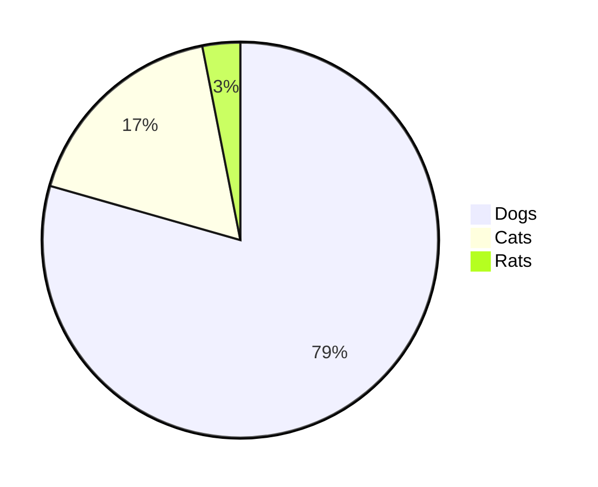
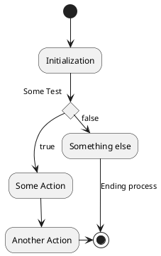

# disruptiveIT
Proyecto de Emprendimiento optar el titulo de Ing. Telematica

```mermaid
pie
"Dogs" : 386
"Cats" : 85
"Rats" : 15
```

```plantuml
@startuml
(*) --> "Initialization"

if "Some Test" then
-->[true] "Some Action"
--> "Another Action"
-right-> (*)
else
->[false] "Something else"
-->[Ending process] (*)
endif

@enduml
```
